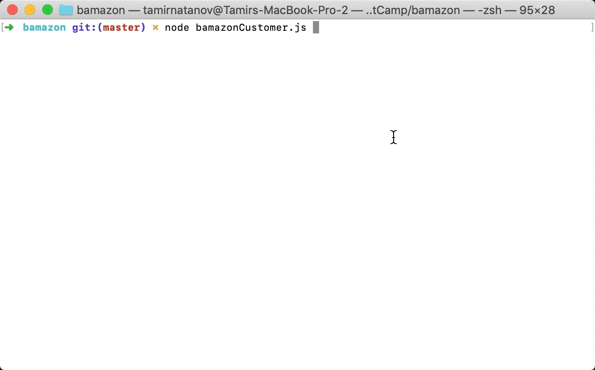
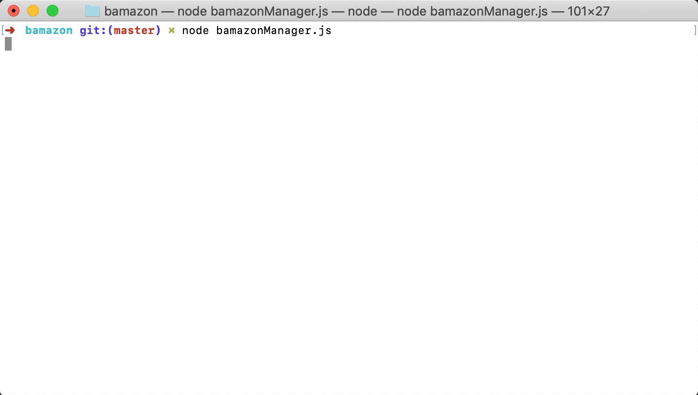

# Bamazon
## Setup
1. Open the file directory in your terminal, Bash, or whatever you use. And run the following line:
```
npm install
```
2. Open your MySQL work environment and run the querys in the .sql file in this project to create and populate a database.
3. Modify the .js files if you use a password and user name for your MySQL.
```javascript
var connection = mysql.createConnection({
    host: "localhost",
    port: YOUR_PORT,
    user: "YOUR_USER",
    password: "YOUR_PASSWORD",
    database: "bamazon"
});
```

# bamazonCostumer.js
What this CLI App does:

This app is designed to be a CLI based amazon like store.

1. To run this CLI App, in your terminal enter the following command:
```
node bamazonCostumer.js
```

2. On intial run user is shown all available items for sale, name of the item, department price, and quantity.
```
item_id  product_name                        department_name  price   stock_quantity
-------  ----------------------------------  ---------------  ------  --------------
1        MacBook Pro                         Computers        2400    169
2        audio-technica ATH-M40x             Accesories       99.98   40
3        audio-technica ATH-M50x             Computers        149.98  120
4        Harry Potter Year One BlueRay       Movies           24.98   200
5        Dyson v6 Vacuum                     Home Appliances  249.98  340
6        iPhone 8 Space Gray 64GB Unlocked   Phones           599     95
7        iPhone 8 Space Gray 256GB Unlocked  Phones           749     91
8        PlayStation 4 Slim                  Video Games      300     197
9        Prada Black Col                     Perfume          100     300
```
3. The user is then asked to provide an Item ID (provided on printed table of all items).
4. Then the amount the user would like to buy.
5. Then a table is printed showing final price and quantity bought.
```
Item ID  Item Name    Cost  Quantity  Total Cost
-------  -----------  ----  --------  ----------
1        MacBook Pro  2400  2         4800
```

6. Live Example:

# bamazonManager.js

What this CLI is desgined to do:

This CLI App gives a manager access to the data by adding new items, adding stock to items by specific ID and view low inventory.

1. To start the App:
```
node bamazonManager.js
```

2. Promted with:
```
? What would you like to do?
  1) View whats for sale.
  2) View low inventory
  3) Add to Inventory
  4) Add new item.
  Answer:
```
3. Live Example of Each Option:
